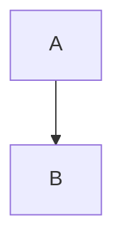
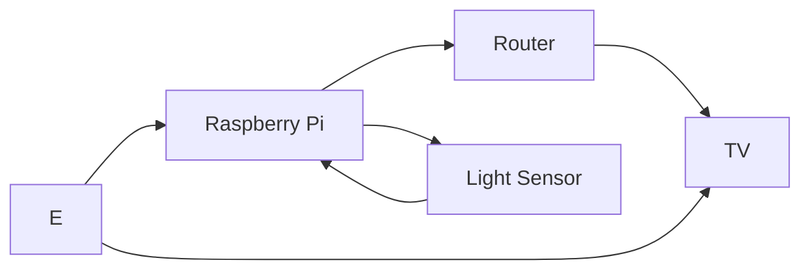

# EGL315-Hologram

## Name
Kim Dongho

*Kim Dongho*

**Kim Dongho**

***Kim Dongho***

## School

There are two options to insert code

### Code Block
```
I am at Nanyang Polytechnic
Block S
Room 540
```

### Code Line
`sudo raspi-config`

## Adding Picture

This is a fantastic picture of a dog?


## Block Diagram

Top Down


Left Right
